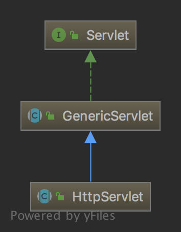
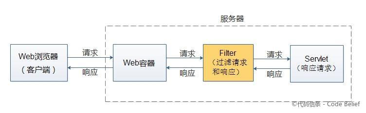

## Servlet demo


### 运行

#### 1. 编译

```shell
javac **/*.java -cp /Users/xushaopeng/Desktop/personal/Java/apache-tomcat-9.0.12/lib/*:.
```

注意添加classpath，主要用到 jsp-api.jar、servlet-api.jar

#### 2. 启动tomcat

```shell
./bin/startup.sh
```

然后将项目文件夹拷贝到tomcat的`webapps` 目录即可访问

<http://127.0.0.1:8090/servlet-demo/>

这里本地tomcat的端口设置成了8090。可以修改 `conf/server.xml` 配置

日志输出可以查看logs 目录

### servlet设置

可以通过web.xml配置

```xml
<servlet-mapping>
    <servlet-name>test</servlet-name>
    <url-pattern>/welcome</url-pattern>
</servlet-mapping>
```

也可以通过注解 `@WebServlet`

```java
@WebServlet(urlPatterns = {"/welcome"}, loadOnStartup = 1)
public class DemoServ extends HttpServlet {

    @Override
    public void doGet(HttpServletRequest req, HttpServletResponse res) throws IOException {
        res.setContentType("text/html");
        PrintWriter pw = res.getWriter();
        String name = req.getParameter("name");
        pw.println("Welcome " + name);
    }
}
```

### 什么是servlet

How Spring Web MVC Really Works：https://stackify.com/spring-mvc/

#### Servlets是Java Web应用的基础

Tomcat是Servlet容器，每一个HTTP请求都会通过Tomcat最终交给一个servlet来处理。

顶层的Servlet接口定义如下：

```java
public interface Servlet {

    /**
     * 你初始化时要做什么
     * Called by the servlet container to indicate to a servlet that the servlet
     * is being placed into service.
     */
    public void init(ServletConfig config) throws ServletException;

    /**
     *
     * Returns a {@link ServletConfig} object, which contains initialization and
     * startup parameters for this servlet. The <code>ServletConfig</code>
     * object returned is the one passed to the <code>init</code> method.
     */
    public ServletConfig getServletConfig();

    /**
		 * 接受到请求时要做什么
     * Called by the servlet container to allow the servlet to respond to a
     * request.
     */
    public void service(ServletRequest req, ServletResponse res)
            throws ServletException, IOException;

    /**
     * Returns information about the servlet, such as author, version, and
     * copyright.
     */
    public String getServletInfo();

    /**
     * 销毁时要做什么
     * Called by the servlet container to indicate to a servlet that the servlet
     * is being taken out of service. This method is only called once all
     * threads within the servlet's <code>service</code> method have exited or
     * after a timeout period has passed. After the servlet container calls this
     * method, it will not call the <code>service</code> method again on this
     * servlet.
     */
    public void destroy();
}
```

一般来说我们自己实现的servlet是继承自抽象类HTTPServlet



```java
public abstract class HttpServlet extends GenericServlet {
    /**
     * service方法会调用这个doGet
     * Called by the server (via the <code>service</code> method) to
     * allow a servlet to handle a GET request.
     */
    protected void doGet(HttpServletRequest req, HttpServletResponse resp)
        throws ServletException, IOException {
        String protocol = req.getProtocol();
        String msg = lStrings.getString("http.method_get_not_supported");
        if (protocol.endsWith("1.1")) {
            resp.sendError(HttpServletResponse.SC_METHOD_NOT_ALLOWED, msg);
        } else {
            resp.sendError(HttpServletResponse.SC_BAD_REQUEST, msg);
        }
    }
    protected void service(HttpServletRequest req, HttpServletResponse resp)
        throws ServletException, IOException {

        String method = req.getMethod();

        if (method.equals(METHOD_GET)) {
            long lastModified = getLastModified(req);
            if (lastModified == -1) {
                // servlet doesn't support if-modified-since, no reason
                // to go through further expensive logic
                doGet(req, resp);
            } else {
                long ifModifiedSince;
                try {
                    ifModifiedSince = req.getDateHeader(HEADER_IFMODSINCE);
                } catch (IllegalArgumentException iae) {
                    // Invalid date header - proceed as if none was set
                    ifModifiedSince = -1;
                }
                if (ifModifiedSince < (lastModified / 1000 * 1000)) {
                    // If the servlet mod time is later, call doGet()
                    // Round down to the nearest second for a proper compare
                    // A ifModifiedSince of -1 will always be less
                    maybeSetLastModified(resp, lastModified);
                    doGet(req, resp);
                } else {
                    resp.setStatus(HttpServletResponse.SC_NOT_MODIFIED);
                }
            }

        } else if (method.equals(METHOD_HEAD)) {
            long lastModified = getLastModified(req);
            maybeSetLastModified(resp, lastModified);
            doHead(req, resp);

        } else if (method.equals(METHOD_POST)) {
            doPost(req, resp);

        } else if (method.equals(METHOD_PUT)) {
            doPut(req, resp);

        } else if (method.equals(METHOD_DELETE)) {
            doDelete(req, resp);

        } else if (method.equals(METHOD_OPTIONS)) {
            doOptions(req,resp);

        } else if (method.equals(METHOD_TRACE)) {
            doTrace(req,resp);

        } else {
            //
            // Note that this means NO servlet supports whatever
            // method was requested, anywhere on this server.
            //

            String errMsg = lStrings.getString("http.method_not_implemented");
            Object[] errArgs = new Object[1];
            errArgs[0] = method;
            errMsg = MessageFormat.format(errMsg, errArgs);

            resp.sendError(HttpServletResponse.SC_NOT_IMPLEMENTED, errMsg);
        }
    }
}
```

`DemoServlet.java` 文件是重写了service方法，然后在service方法里写业务逻辑。

但是如果以这种模式来开发，"会导致数据访问逻辑和业务逻辑以及视图渲染逻辑相互混杂"，都在一个servlet。所以就有了后来的Spring MVC(《Spring揭秘》）

### Filter

Filter 是介于 Web 容器和 Servlet 之间的过滤器，用于过滤未到达 Servlet 的请求或者由 Servlet 生成但还未返回响应。



### Listener

Listener 是用于监听某些特定动作的监听器。当特定动作发生时，监听该动作的监听器就会自动调用对应的方法。

### 其他

Servlet是单例的，只会在第一次被访问时加载到内存并实例化。


### 参考

- <https://www.javatpoint.com/steps-to-create-a-servlet-using-tomcat-server>
- JavaEE-Servlet-Filter和Listener：<https://www.jianshu.com/p/46e5b3bf42d7>
- Servlet、Filter 和Listener 工作原理：<https://www.cnblogs.com/windlaughing/archive/2013/03/29/2989052.html>
- servlet的本质是什么，它是如何工作的？https://www.zhihu.com/question/21416727
- Tomcat源代码学习：https://github.com/codefollower/Tomcat-Research
- Java Web：三张图理解 Servlet、Filter、Listener：http://www.codebelief.com/article/2017/09/java-web-understand-servlet-filter-listener-via-three-pictures/